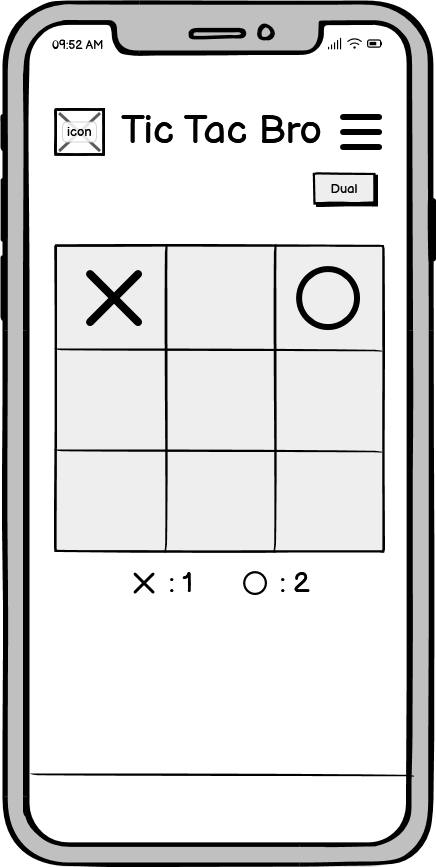
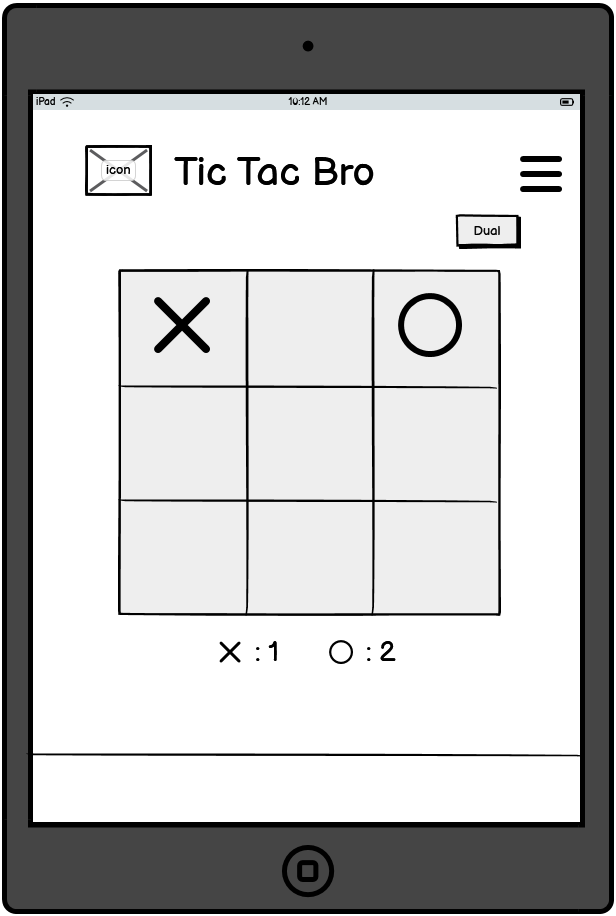
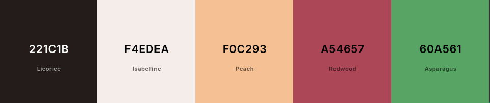

# Tic Tac Bros

Tic Tac Bros is a web app game that lets friends and family enjoy the classic game of Tic-Tac-Toe together. It features a simple and modern design with smooth functionality. The game works well on desktops, tablets, and mobiles, making it fun and easy to play anywhere.

Visit the live site [here](https://catrin.is-a.dev/tic-tac-bro/)

[Insert an example responsive mockup image here]

## Contents

- [UX (User Experience)](#ux-user-experience)
- [Design](#design)
- [Website Features](#website-features)
- [Tablet/Mobile View](#tabletmobile-view)
- [Future Features](#future-features)
- [Technologies Used](#technologies-used)
- [Deployment](#deployment)
- [Testing](#testing)
- [Credits](#credits)

## UX (User Experience)

### User Stories

- As a user, I want to easily navigate the website and start a game without hassle.
- As a user, I want the website to look visually appealing and responsive on all devices.

**Navigation Bar**

- As a user, I can read a clear title and a rules toggle so that I know the website name and read the rules of the game.

**Switching Mode Button**

- As a user, I can switch between two gaming modes, one-to-one and computer mode, so that I can play with another player or against a computer.

**Game**

- As a user, I can see the gaming board and a reset so that I can play Tic-Tac-Toe with another player locally.
- As a user, I can see the text showing which turn is it so that I know which player can make the move now.
- As a user, I can see the winning cells highlighted so that I know how the player won.

**Reset Button**

- As a user, I can see the reset button so that I can restart the game.

**Score Board**

- As a user, I can see the score between two players so that I know the results.

**Footer**

- As a user, I can see the credit in the footer.

### Strategy

The goal was to design a simple and accessible game platform that encourages social interaction while offering the familiar and fun experience of a universally loved game.

### Scope

The project includes a fully functional Tic-Tac-Toe game for two players with plans for adding AI and scoring systems.

### Structural

The website structure follows a single-page design, making it easy for users to navigate the website and switch between the game and other information.

### Skeleton (Wireframes)

**Mobile View**:

  

**Tablet View**:

  

### Surface

The design features a clean layout with a light colour palette. The 'X' and 'O' are highlighted in blue and yellow for clear distinction. Interactive elements are easy to identify, ensuring a good user experience on all devices.

## Design

### Typography

- Primary font: [Barriecito](https://fonts.google.com/specimen/Barriecito?categoryFilters=Feeling:%2FExpressive%2FPlayful&preview.text=Tic%20Tac%20Bro)
- Secondary font: [Fontdiner Swanky](https://fonts.google.com/specimen/Fontdiner+Swanky?categoryFilters=Feeling:%2FExpressive%2FPlayful&preview.text=Tic%20Tac%20Bro&query=Fontdiner+Swanky)

### Colour Scheme

- #221C1B: Dark for grid and text
- #F4EDEA: Light cream for background
- #F0C293: Peach for accent highlights
- #A54657: Deep red for 'X'
- #60A561: Green for 'O'

You can see the colour theme [here](https://coolors.co/221c1b-f4edea-f0c293-a54657-60a561).

### Imagery

Minimalist and modern imagery focusing on the Tic-Tac-Toe grid and game pieces.

## Website Features

### Existing Features

- **Navigation Bar**: Displays the logo and provides quick access to game rules.
- **Switching Mode Button**: Allows switching between two-player mode and one-player vs. computer mode.
- **Game**: Fully interactive 3x3 tic-tac-toe board.
- **Reset Button**: Allows players to restart the game at any point.
- **Scoreboard**: Shows the scores at the bottom.
- **Footer**: Shows credits to the team.

### JavaScript Logic/Functionality

**Board Creation**

- The `createBoard` function generates a 3x3 grid dynamically using HTML.
- Each cell is styled and linked to an event listener for user interaction.
- This ensures that the game can reset and rebuild the board dynamically.

**Handling User Clicks**

- The `handleClick` function ensures that only empty cells can be selected.
- It updates the cell with the current player's symbol (X or O) and switches to the next player.
- If the game is already won or the cell is not empty, it prevents further interaction.

**Check for a Win**

- The `checkWin` function uses predefined `winningCombinations` to determine if a player has successfully aligned three symbols.
- It checks all cells in each combination to match the current player's symbol.
- If a winning combination is found, the cells are highlighted with a green background using the `highlight` function.

**Highlighting Winning Combination**

- The `highlight` function colours the winning cells to visually indicate the winning line.

**Check for a Tie**

- The `checkTie` function checks if all cells are filled without a winner.
- It uses the `Array.from` method to convert the cell list into an array and ensures none are empty.

**Update and Display Scores**

- The `updateScores` function keeps track of the scores for each player (X and O).
- It updates the DOM to display the current scores after each win.

**Game Reset**

- The `resetGame` function clears the board, resets the winning state, and prepares the game for a new round.
- It ensures that the background colour and symbols are cleared, and the game starts with player X.

**Dynamic Player Turn Indicator**

- The `endMessage` dynamically updates to show whose turn it is, whether the game is tied, or if there’s a winner.
- This ensures the user is informed at every stage of the game.

## Tablet/Mobile View

Responsive layout ensures the grid scales appropriately, and buttons are easily accessible on smaller screens. Interactive elements are optimised for touch input.

## Future Features

- AI opponent for single-player mode.
- Customisable themes for the game board.
- Multiplayer support over the internet.

## Technologies Used

### Languages

- HTML
- CSS
- JavaScript

### Frameworks/Libraries/Programs

- Frameworks or libraries:

  - Bootstrap
  - Font Awesome
  - Google Fonts

- Design software:
  - Figma
  - Balsamiq
  - Coolors

## Deployment

- The site was deployed to GitHub pages. The steps to deploy are as follows:
  - In the GitHub repository, navigate to the Settings tab
  - From the source section drop-down menu, select the `deploy` Branch
  - Once the `deploy` branch has been selected, the page will be automatically refreshed with a detailed ribbon display to indicate the successful deployment.

The live link can be found here - https://catrin.is-a.dev/tic-tac-bro/

## Testing

Please see [TESTING.md](TESTING.md) file for all manual testing.

### Bugs

## Credits

- https://www.geeksforgeeks.org/simple-tic-tac-toe-game-using-javascript/ - Used the wins array to define our win conditions.
- https://www.thatsoftwaredude.com/content/6189/step-by-step-guide-to-coding-tic-tac-toe-in-javascript - Followed some of the steps to help write the Javascript.
- https://medium.com/@canankorkut1/how-to-create-a-tic-tac-toe-with-html-css-and-javascript-10a25fddd356 - Used for implementing game logic.
- Copilot - Used for autocomplete and to add styles in the JavaScript for faster coding.

### Content References

- [Google Fonts](https://fonts.google.com/) was used for font styling
- [Font Awesome](https://fontawesome.com/) was used for X and O icons

### Team

- Amina [GitHub](https://github.com/aminoacid-01)
- Catrin [GitHub](https://github.com/catrinlam)
- Grace [GitHub](https://github.com/Gracey46)
